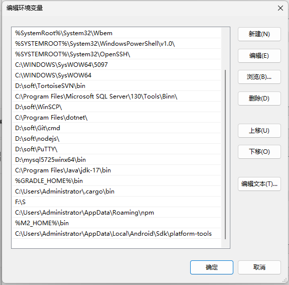
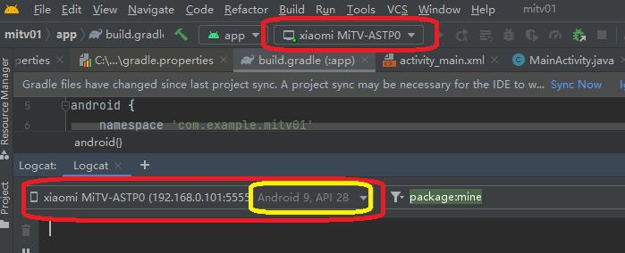

adb调试

连接同一个网络，打开电视的开发者模式，开启adb调试。

```
//连接到电视 TV 设备
adb connect your_tv_ip:5555
//查看已连接的设备
adb devices
//
```

在 Android Studio 中选择调试设备

- 打开 Android Studio，运行你的 TV 应用。
- 当弹出 “Select Deployment Target” 对话框时，选择你刚刚连接的电视 TV 设备

开始调试

点击 Android Studio 中的 “Debug” 按钮，这样就能在电视 TV 设备上远程调试你的应用了。

注意事项

- 要是连接失败，你可以尝试重新启动电视 TV 设备和 ADB 服务。在命令行中输入 `adb kill-server` 来停止 ADB 服务，接着输入 `adb start-server` 重新启动服务。

```
C:\Users\Administrator>adb connect 192.168.0.101:5555
'adb' 不是内部或外部命令，也不是可运行的程序
或批处理文件。
```

检查 C:\Users\Administrator\AppData\Local\Android\Sdk\platform-tools目录下有无adb.exe文件



添加地址到环境变量

```
C:\Users\Administrator>adb version
Android Debug Bridge version 1.0.41
Version 35.0.2-12147458
Installed as C:\Users\Administrator\AppData\Local\Android\Sdk\platform-tools\adb.exe
Running on Windows 10.0.26100
```

```
C:\Users\Administrator>adb connect 192.168.0.101:5555
failed to authenticate to 192.168.0.101:5555
//这里失败一次是因为电视弹出确认框，允许开发电脑调试操作，再试一次就可以了
C:\Users\Administrator>adb connect 192.168.0.101:5555
already connected to 192.168.0.101:5555

C:\Users\Administrator>adb devices
List of devices attached
192.168.0.101:5555      device
emulator-5554   device
```

make project 在项目的 `app/build/outputs/apk/debug` 目录下找到生成的 APK 文件(如果是 debug 版本),在当前目录下打开命令行

```
adb install app-debug.apk
```

```
D:\12_workspace\android_workspace\mitv01\app\build\outputs\apk\debug>adb install app-debug.apk
adb.exe: more than one device/emulator
```

```
D:\12_workspace\android_workspace\mitv01\app\build\outputs\apk\debug>adb install app-debug.apk
adb.exe: more than one device/emulator

D:\12_workspace\android_workspace\mitv01\app\build\outputs\apk\debug>adb devices
List of devices attached
192.168.0.101:5555      device
emulator-5554   device

//使用-s来指定设备安装
D:\12_workspace\android_workspace\mitv01\app\build\outputs\apk\debug>adb -s 192.168.0.101:5555 install app-debug.apk
Performing Streamed Install
Success

D:\12_workspace\android_workspace\mitv01\app\build\outputs\apk\debug>
```

应用安装成功后，可能由于某些原因未能正常启动或者在后台崩溃，从而导致在电视主屏幕上看不到应用图标。

```
2025-04-19 11:17:06.342 22227-22227 i.mitv.appstor          com.xiaomi.mitv.appstore             E  Failed to open APK '/data/app/com.example.mitv01-ihXp-pH9MuFKjakJ23XOmw==/base.apk' I/O error
2025-04-19 11:17:06.342 22227-22227 ResourcesManager        com.xiaomi.mitv.appstore             E  failed to add asset path /data/app/com.example.mitv01-ihXp-pH9MuFKjakJ23XOmw==/base.apk
//分析下来应该是io的报错，看看是不是没有存储相关的权限
```

```
     //AndroidManifest.xml 中声明必要权限
    <uses-permission android:name="android.permission.INTERNET" />
    <uses-permission android:name="android.permission.READ_EXTERNAL_STORAGE" />
    <uses-permission android:name="android.permission.WRITE_EXTERNAL_STORAGE" />
```

```
PS D:\12_workspace\android_workspace\mitv01\app\build\outputs\apk\debug> adb shell df /data
Filesystem       1K-blocks   Used Available Use% Mounted on
/dev/block/dm-38   6082144 839192   5100740  15% /data/user/0
//这里剩余空间还有5个G，远大于标准的100M，可以确定安装失败和剩余空间没有关系
```

ADB 安装成功但应用被禁用或未启用。

adb shell pm enable com.example.mitv01

```
PS D:\12_workspace\android_workspace\mitv01\app\build\outputs\apk\debug> adb shell pm enable com.example.mitv01
Package com.example.mitv01 new state: enabled
PS D:\12_workspace\android_workspace\mitv01\app\build\outputs\apk\debug>
```

```
//确保 ADB 连接时使用的是默认用户（用户 0）
adb install --user 0 app-debug.apk
//查看应用安装路径
adb shell pm path com.example.mitv01
# 正常输出示例：package:/data/app/~~xxxxx==/com.example.mitv01-xxxxx==/base.apk
```

```
//强制重启电视，保证刷新扫描新安装的应用
adb reboot
//查看电视系统版本
PS D:\12_workspace\android_workspace\mitv01\app\build\outputs\apk\debug> adb shell getprop ro.build.version.release
14
// targetSdkVersion 设置为 34（Android 14 对应的 API 级别是 34）
//但是这里我犯了一个错误,没有指定设备
PS D:\12_workspace\android_workspace\mitv01\app\build\outputs\apk\debug> adb -s 192.168.0.101 shell getprop ro.build.version.release
9
//这下确定了电视的系统是Android9 API 28
```

//logcat界面居然也好心的提示了



使用以下`adb`命令能获取到设备上所有已安装应用的包名

adb -s 192.168.0.101:5555 shell pm list packages

**获取用户安装的应用**：

adb -s 192.168.0.101:5555 shell pm list packages -3

卸载应用

adb -s 192.168.0.101:5555 uninstall com.example.mitv01

安装应用

adb -s 192.168.0.101:5555 install -r -t .\app-release.apk

还是老问题

--------- beginning of system
2025-04-19 19:37:18.194 15072-15072 i.mitv.appstor          com.xiaomi.mitv.appstore             E  Failed to open APK '/data/app/com.example.mitv01-JocmQXgAAnVUIM45qXZpww==/base.apk' I/O error
2025-04-19 19:37:18.194 15072-15072 ResourcesManager        com.xiaomi.mitv.appstore             E  failed to add asset path /data/app/com.example.mitv01-JocmQXgAAnVUIM45qXZpww==/base.apk


//看看是否存在com.example.mitv01

PS D:\12_workspace\android_workspace\mitv01\app\release> adb -s 192.168.0.101:5555 shell pm list packages | Select-String -Pattern "com.example.mitv01"

package:com.example.mitv01

//获取com.example.mitv01的文件位置

PS D:\12_workspace\android_workspace\mitv01\app\release> adb -s 192.168.0.101:5555 shell pm path com.example.mitv01
package:/data/app/com.example.mitv01-KoLN8yVxnDCikI02DeVM9g==/base.apk
PS D:\12_workspace\android_workspace\mitv01\app\release>

//尝试启动应用

PS D:\12_workspace\android_workspace\mitv01\app\release> adb -s 192.168.0.101:5555 shell am start -n com.example.mitv01/.MainActivity
Starting: Intent { cmp=com.example.mitv01/.MainActivity }
PS D:\12_workspace\android_workspace\mitv01\app\release>

//查看应用日志信息

adb -s 192.168.0.101:5555 logcat | Select-String -Pattern "com.example.mitv01"

//既然应用能够成功启动，那就说明 APK 文件本身基本是没问题的，之前日志里提到的 `Failed to open APK` 错误可能是 `com.xiaomi.mitv.appstore` 在特定操作时产生的临时性问题。


